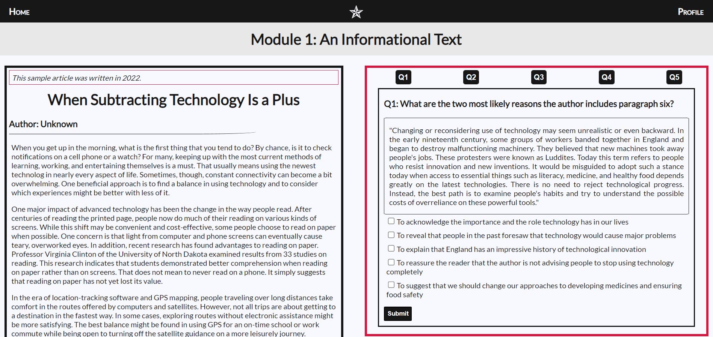
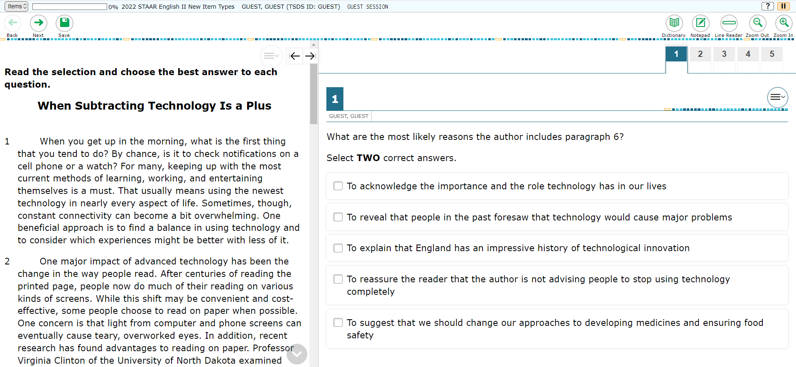
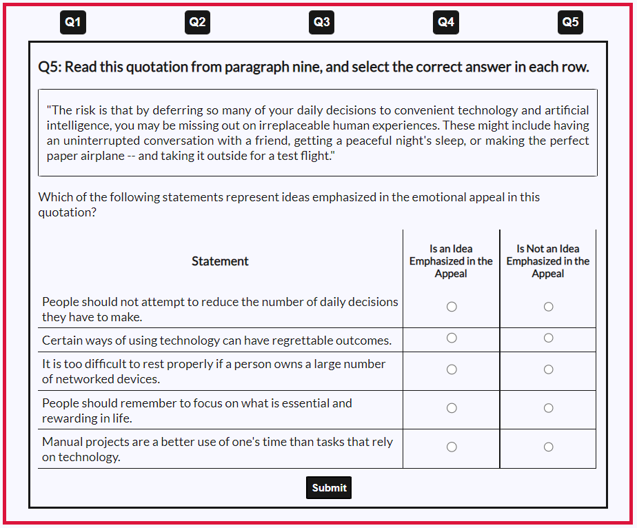
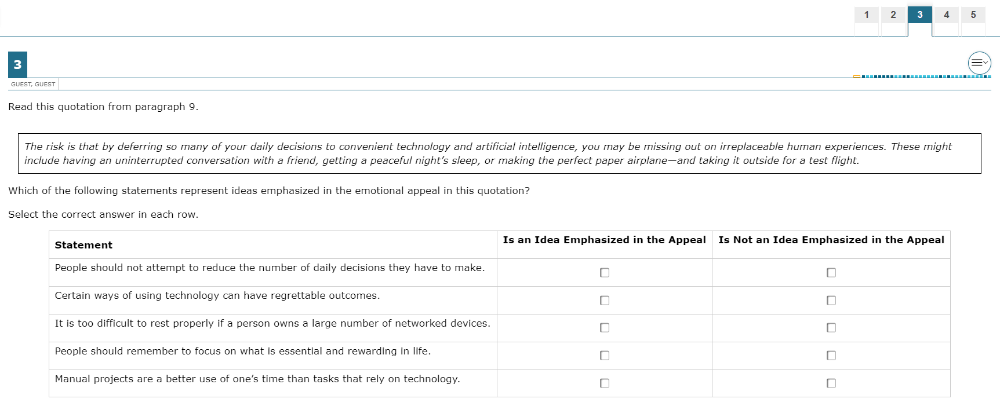
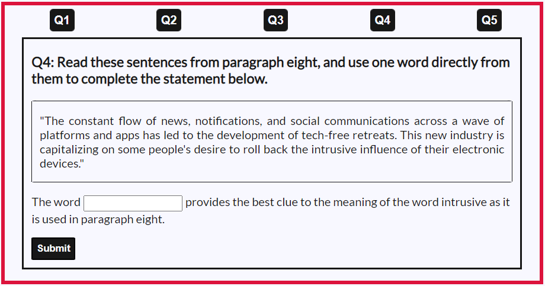
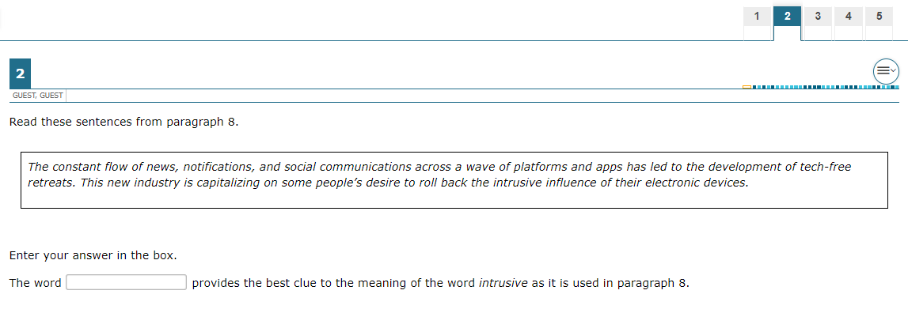
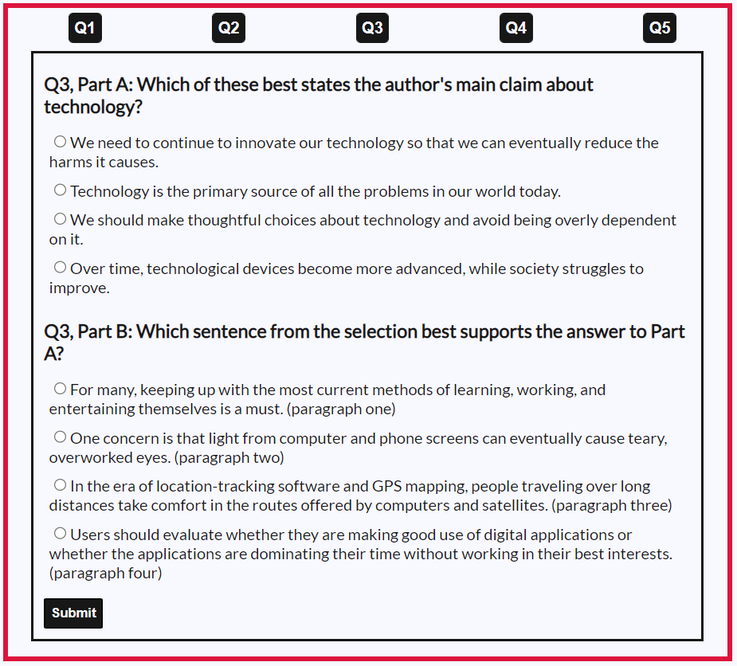
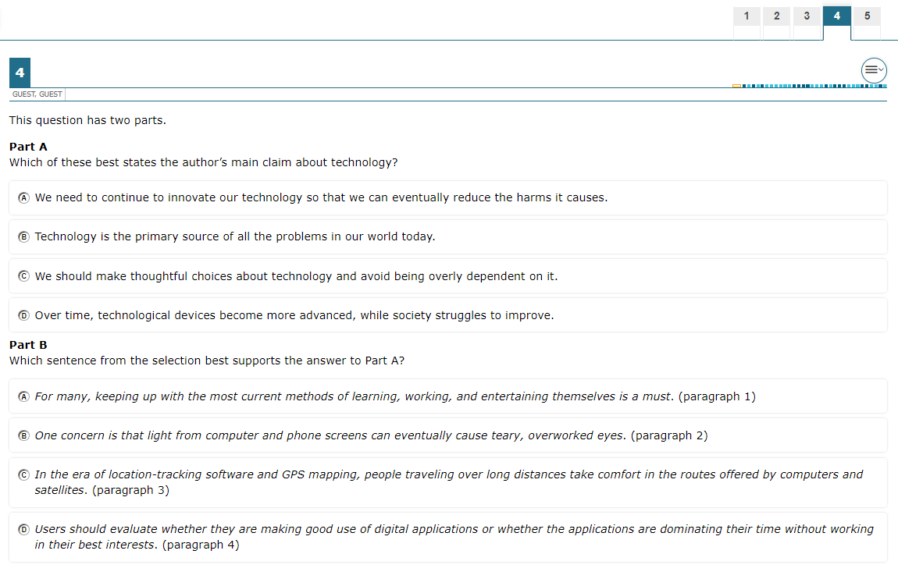
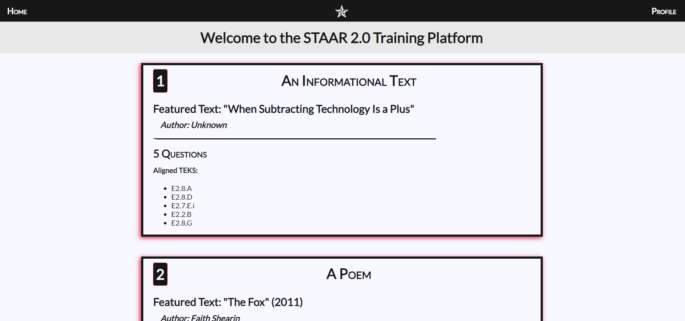
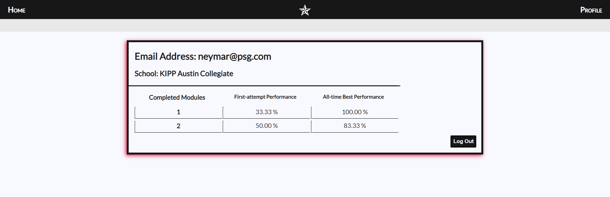

# An Open-source STAAR 2.0 Training Platform

This is the front-end of a free and open-source STAAR 2.0 training platform for high school students. The project is currently in beta, but it is designed to be used by all educators in the state of Texas. If you are more interested in the ExpressJS-based backend, then follow this link: https://github.com/sthomasmeyer/express-staar-training-program-backend

## Tech Stack

1. React, Create React App, React Router, React Testing Library
2. Node
3. ExpressJS
4. PostgreSQL
5. CSS
6. Jest
7. Axios
8. JSON Web Tokens
9. JSON Schema
10. Bcrypt

## Noteworthy Features:

### New Question Types

These question types are aligned to the new item types that students should expect to face on the re-designed STAAR Exam. They are modeled after a practice exam that the Texas Education Agency (TEA) released in 2022.

#### 1) Multi-select

###### Open-source version:

###### Official TEA version:

#### 2) Table-style

###### Open-source version:

###### Official TEA version:

#### 3) Text-entry

###### Open-source version:

###### Official TEA version:

#### 4) Two-part

###### Open-source version:

###### Official TEA version:

### Module Preview

Students can preview key information about a module before attempting it. This includes: (1) the featured text, (2) author, (3) number of questions, and (4) aligned standards.

### Performance Data

Students can easily track completed modules, and they can see valuable data about their first-attempt and all-time best performance.

